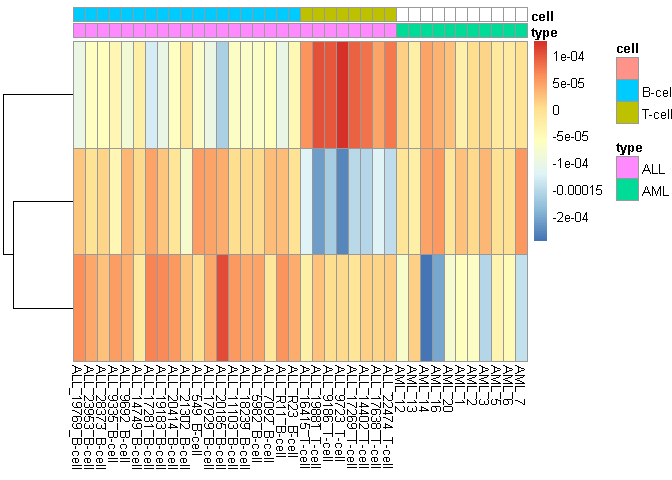
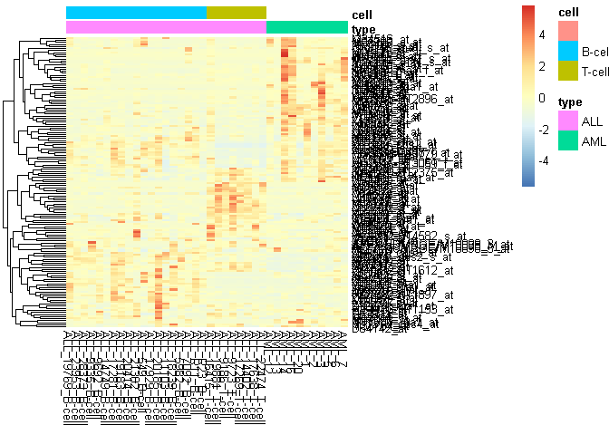
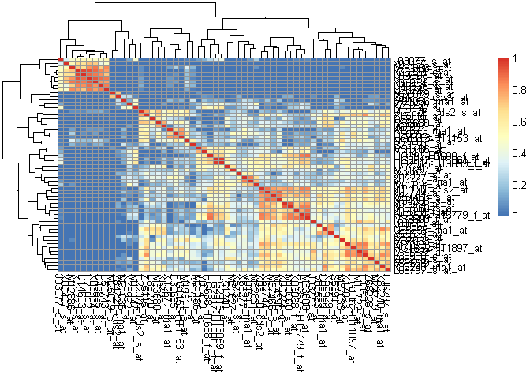
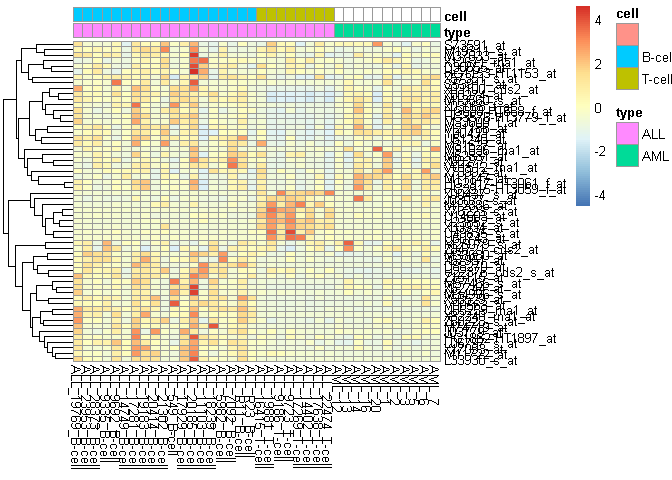
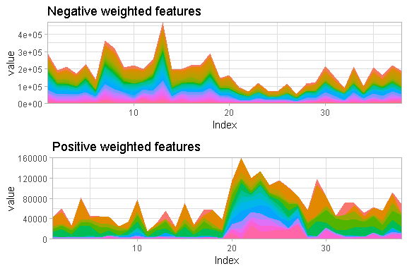
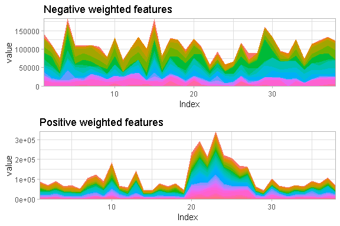

ICA
================

Data
====

    ## Features  Samples 
    ##     5000       38

    ##             ALL_19769_B-cell ALL_23953_B-cell ALL_28373_B-cell
    ## M12759_at               1080              114               89
    ## U46006_s_at              211              731              439
    ## X70083_at                 20               20               20

Indepedent components
=====================

Plotting all important features
===============================

Correlation between important features, specific to PC 'i'
==========================================================

Plot expression of features, specific to PC 'i'
===============================================

Plot expression of positive and negatively weighted features
============================================================

ICA1
----

ICA 2
-----

