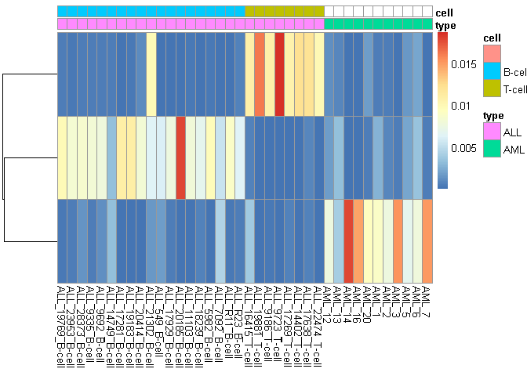
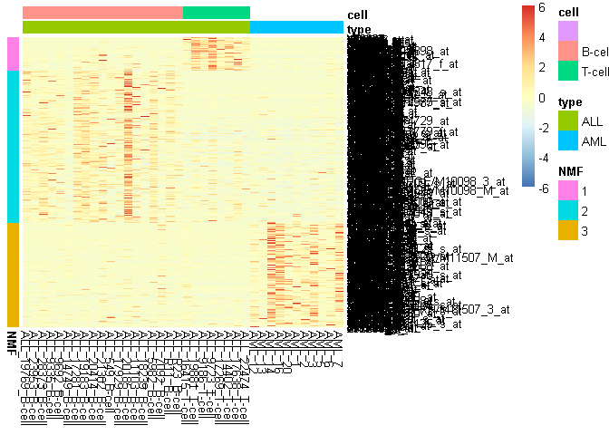
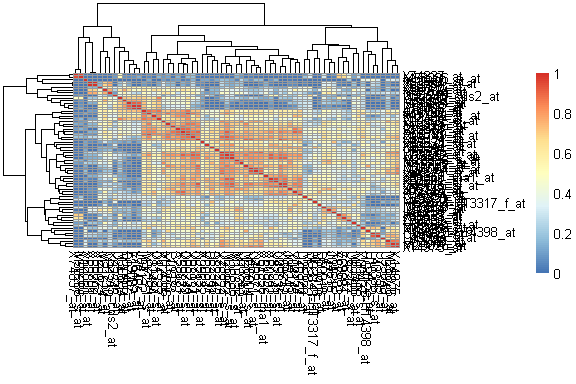
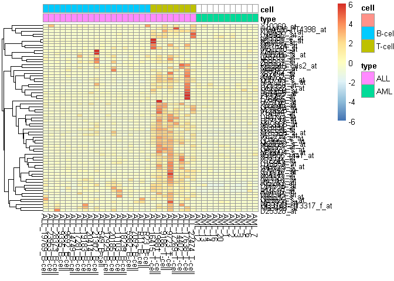
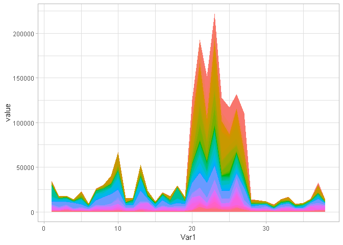

PCA
================

Data
====

    ## Features  Samples 
    ##     5000       38

NMFs
====

Plotting important features
===========================

Correlation between important features, specific to PC 'i'
==========================================================

Plot features, specific to PC 'i'
=================================

