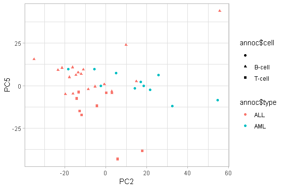
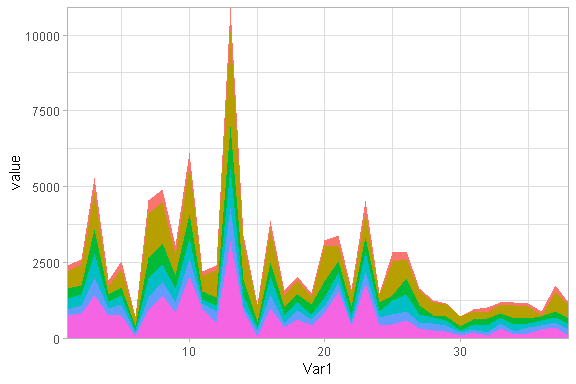

PCA
================

Data
====

    ## Features  Samples 
    ##     5000       38

    ##             ALL_19769_B-cell ALL_23953_B-cell ALL_28373_B-cell
    ## M12759_at               1080              114               89
    ## U46006_s_at              211              731              439
    ## X70083_at                 20               20               20

Variance explained
==================

Plotting important PCs
======================

    ## [1] "Significant PCs: 5"

Plotting all important features
===============================

Plot expression of features for PC1
===================================

    ## [1] "Features for component: 1"

Plot expression of features for PC2
===================================

Correlation between important features, specific to PC5
=======================================================

Expression of features pf PC5
=============================

